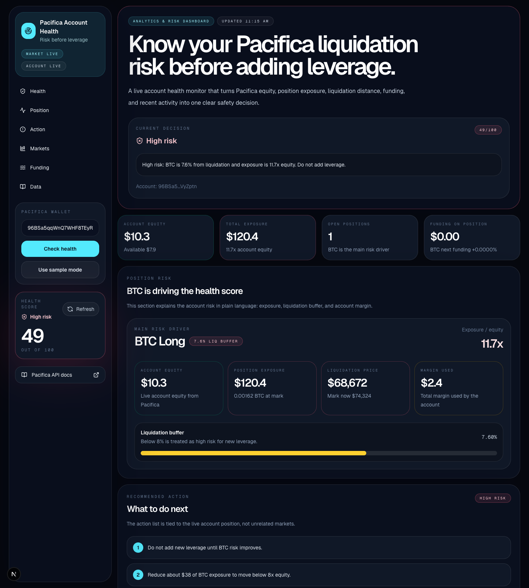
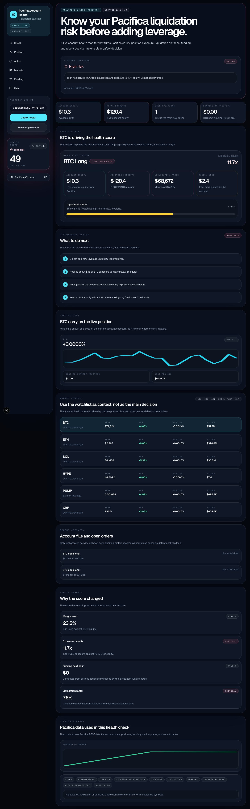
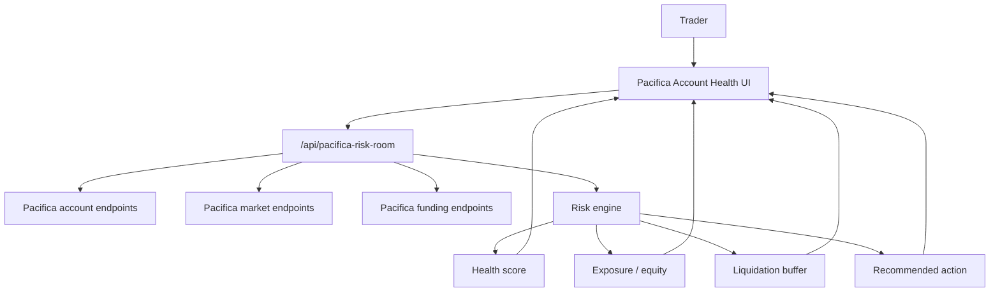
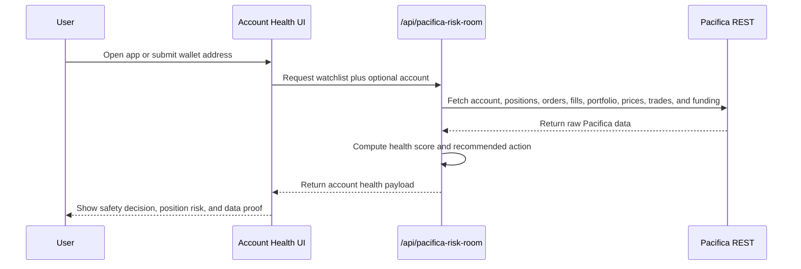

# Pacifica Account Health




Know your Pacifica liquidation risk before adding leverage.

Pacifica Account Health is a live risk dashboard for Pacifica perpetuals accounts. It turns account equity, position exposure, liquidation distance, funding, recent fills, and market context into one clear answer:

**Is this account safe to add leverage right now?**

## Product Summary

The app opens on a real Pacifica account and immediately explains:

- account health score
- current risk state: healthy, watch, or high risk
- largest position driving the score
- exposure divided by equity
- liquidation buffer
- recommended next action
- live data proof from Pacifica REST endpoints

For the current live account demo, the product detects that the BTC position is the main risk driver: exposure is around `11x` account equity and the liquidation buffer is below the high-risk threshold. The app recommends not adding leverage and reducing BTC exposure before taking fresh directional risk.

## Why Analytics & Data

Pacifica's hackathon track definition for `Analytics & Data` includes market intelligence, PnL tracking, and risk dashboards. This project maps directly to that track:

- `Market intelligence`: live Pacifica prices, funding, open interest, volume, and watchlist context.
- `PnL and posture tracking`: account equity, available balance, positions, fills, and portfolio replay.
- `Risk dashboard`: account health score, exposure/equity, liquidation buffer, funding cost, and recommended action.

It is not an auto-trading bot. The value is decision support before the trader adds more leverage.

## For Judges

| Item | Evidence |
| --- | --- |
| Track | `Analytics & Data` |
| Live app | `https://pacifica-risk-room.vercel.app` |
| Product route | [`app/page.tsx`](app/page.tsx) and [`app/pacifica-risk-room/page.tsx`](app/pacifica-risk-room/page.tsx) |
| API route | [`app/api/pacifica-risk-room/route.ts`](app/api/pacifica-risk-room/route.ts) |
| Risk engine | [`lib/pacificaRiskRoom.ts`](lib/pacificaRiskRoom.ts) |
| Main UI | [`components/PacificaRiskRoom/PacificaRiskRoomPage.tsx`](components/PacificaRiskRoom/PacificaRiskRoomPage.tsx) |
| Demo script | [`docs/DEMO_VIDEO_SCRIPT.md`](docs/DEMO_VIDEO_SCRIPT.md) |
| Submission answers | [`docs/SUBMISSION_FORM_ANSWERS.md`](docs/SUBMISSION_FORM_ANSWERS.md) |

## Pacifica APIs Used

- `GET /info`
- `GET /info/prices`
- `GET /trades?symbol=...`
- `GET /funding_rate/history?symbol=...`
- `GET /account?account=...`
- `GET /positions?account=...`
- `GET /orders?account=...`
- `GET /trades/history?account=...`
- `GET /positions/history?account=...`
- `GET /portfolio?account=...&time_range=1d`

## Scorecard

| Judging criteria | Evidence in this project |
| --- | --- |
| Innovation | Turns Pacifica account, position, funding, and market telemetry into a single pre-liquidation account health decision. |
| Technical execution | Aggregates multiple Pacifica REST endpoints, computes derived risk metrics, handles live/sample modes, and renders a real-time Next.js product. |
| User experience | First screen answers the user question directly: whether the account is safe to add leverage and what action to take next. |
| Potential impact | Perps traders can reduce avoidable liquidations by seeing exposure/equity, liquidation buffer, and funding cost before increasing risk. |
| Presentation | README, screenshots, demo script, and form-ready answers are included. |

## Screenshots

| Account health | Full product |
| --- | --- |
|  |  |

## Product Flow

1. Open the app.
2. The default live Pacifica wallet loads automatically.
3. Read the account health score and current decision.
4. Inspect the position driving the score.
5. Review the recommended action: do not add leverage, reduce exposure, or add collateral.
6. Use market and funding panels as context.
7. Open Live Data Proof to see the Pacifica endpoints used.

## Architecture



## Runtime Sequence



## What Makes It Different

| Generic perps dashboard | Pacifica Account Health |
| --- | --- |
| Starts with charts | Starts with whether the account is safe |
| Shows many markets equally | Identifies the position driving account risk |
| Displays raw liquidation or funding numbers | Converts them into liquidation buffer and funding cost |
| Leaves next step unclear | Recommends a concrete risk action tied to the live position |
| Looks like a data dump | Shows data proof only after the decision is clear |

## Local Run

```bash
npm install
npm run dev
```

Open:

```text
http://localhost:3000
```

## Submission Package

- README: this file
- Live route: `/`
- Compatibility route: `/pacifica-risk-room`
- Demo script: [`docs/DEMO_VIDEO_SCRIPT.md`](docs/DEMO_VIDEO_SCRIPT.md)
- Submission answers: [`docs/SUBMISSION_FORM_ANSWERS.md`](docs/SUBMISSION_FORM_ANSWERS.md)
