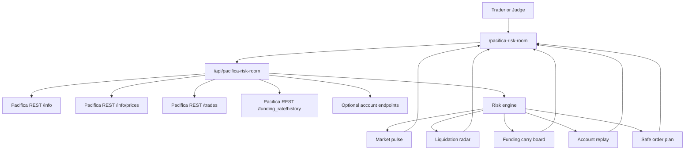
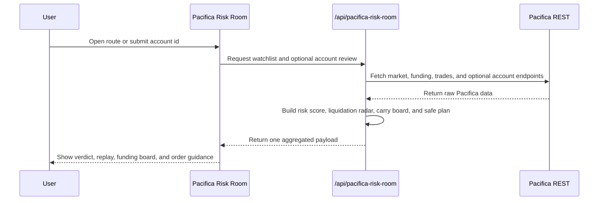

# Pacifica Risk Room


Real-time risk, funding, liquidation, and account replay intelligence for Pacifica perpetuals.

## 30-Second Pitch

Pacifica Risk Room is an operator dashboard for Pacifica perps.

It is not another chart page and not another trading bot.

Its job is to turn Pacifica market and account data into a faster risk decision:

- which markets are crowded
- where liquidation stress is appearing
- how much next funding could cost
- whether a trader has room to add risk
- what a bounded next order should look like

The product combines:

- market pulse for a Pacifica watchlist
- liquidation radar from Pacifica recent trades
- funding carry board from Pacifica funding history
- live account review when a Pacifica account id is provided
- sample account fallback for demo continuity
- safe order plan with leverage and size caps

## For Judges

| Item | Evidence |
| --- | --- |
| Track | `Analytics & Data` |
| Product route | [`app/pacifica-risk-room/page.tsx`](app/pacifica-risk-room/page.tsx) |
| API route | [`app/api/pacifica-risk-room/route.ts`](app/api/pacifica-risk-room/route.ts) |
| Risk engine | [`lib/pacificaRiskRoom.ts`](lib/pacificaRiskRoom.ts) |
| README | [`README.md`](README.md) |
| Demo script | [`docs/DEMO_VIDEO_SCRIPT.md`](docs/DEMO_VIDEO_SCRIPT.md) |
| Submission answers | [`docs/SUBMISSION_FORM_ANSWERS.md`](docs/SUBMISSION_FORM_ANSWERS.md) |
| Pacifica APIs used | `GET /info`, `GET /info/prices`, `GET /trades`, `GET /funding_rate/history`, `GET /account`, `GET /positions`, `GET /orders`, `GET /trades/history`, `GET /positions/history`, `GET /portfolio` |

## Scorecard

| Judging criteria | Evidence in this project |
| --- | --- |
| Innovation | Not a generic quote board. Pacifica Risk Room turns perps-specific carry, liquidation stress, margin usage, and safe execution boundaries into one operator view. |
| Technical execution | Live Pacifica REST aggregation, fallback handling, derived risk engine, account replay, and judge-ready route are all implemented. |
| User experience | One-page path: verdict first, then market pulse, funding carry, liquidation radar, account replay, and bounded order plan. |
| Potential impact | Pacifica traders need faster answers before they add leverage, not just after a liquidation happens. |
| Presentation | README, screenshots, demo script, and submission answers are included. |

## Proof Snapshot

This repository verifies the following implementation facts directly from code:

| Verified fact | Source |
| --- | --- |
| Default watchlist includes `BTC`, `ETH`, `SOL`, `XRP`, `HYPE`, and `PUMP` | [`lib/pacificaRiskRoom.ts`](lib/pacificaRiskRoom.ts) |
| Market data is fetched from Pacifica `info` and `info/prices` endpoints | [`app/api/pacifica-risk-room/route.ts`](app/api/pacifica-risk-room/route.ts) |
| Liquidation radar is built from Pacifica `trades` | [`app/api/pacifica-risk-room/route.ts`](app/api/pacifica-risk-room/route.ts) |
| Funding board is built from Pacifica `funding_rate/history` | [`app/api/pacifica-risk-room/route.ts`](app/api/pacifica-risk-room/route.ts) |
| Account review uses Pacifica `account`, `positions`, `orders`, `trades/history`, `positions/history`, and `portfolio` | [`app/api/pacifica-risk-room/route.ts`](app/api/pacifica-risk-room/route.ts) |
| Auto-refresh cadence is `20` seconds | [`components/PacificaRiskRoom/PacificaRiskRoomPage.tsx`](components/PacificaRiskRoom/PacificaRiskRoomPage.tsx) |
| Sample account fallback is built in for demo continuity | [`lib/pacificaRiskRoom.ts`](lib/pacificaRiskRoom.ts) |

## Screenshots

| Hero | Risk verdict and carry board |
| --- | --- |
|  |  |

## Architecture



## Runtime Sequence



## What Makes It Different

| Generic dashboard | Pacifica Risk Room |
| --- | --- |
| Shows prices and maybe a PnL number | Shows a risk verdict tied to margin usage, liquidation distance, funding drag, and market crowding |
| Requires multiple tabs to inspect liquidation stress | Pulls liquidation and outsized trade prints into one radar |
| Makes funding feel like an isolated stat | Converts funding into carry cost per `$1k` notional |
| Breaks when no live account is configured | Keeps demo continuity with an explicit sample account mode |
| Leaves execution sizing implicit | Produces a safe order plan with leverage cap and size cap |

## Product Surface

### 1. Market Pulse

- mark, oracle, mid
- 24h move
- open interest
- 24h volume
- leverage ceiling
- crowding score

### 2. Liquidation Radar

- recent liquidation or settlement prints
- notional sizing
- severity classification
- time ordering for stress awareness

### 3. Funding Carry Board

- next funding per market
- carry cost per `$1k`
- impact spread
- recent funding curve

### 4. Account Replay

- equity
- available capital
- margin used
- open positions
- open orders
- recent fills
- recent closed positions

### 5. Safe Order Plan

- action: `wait`, `probe`, `reduce`, `hedge`
- leverage cap
- size cap
- order type
- invalidation note

## Repository Map

| Path | Purpose |
| --- | --- |
| [`app/pacifica-risk-room/page.tsx`](app/pacifica-risk-room/page.tsx) | Secondary route entry for compatibility |
| [`app/page.tsx`](app/page.tsx) | Standalone homepage route |
| [`components/PacificaRiskRoom/PacificaRiskRoomPage.tsx`](components/PacificaRiskRoom/PacificaRiskRoomPage.tsx) | Main judge-facing product surface |
| [`app/api/pacifica-risk-room/route.ts`](app/api/pacifica-risk-room/route.ts) | Pacifica REST aggregation and payload assembly |
| [`lib/pacificaRiskRoom.ts`](lib/pacificaRiskRoom.ts) | Types, parsers, sample data, and risk engine |
| [`docs`](docs) | Submission materials |

## Pacifica Integration

Pacifica Risk Room uses Pacifica-native data instead of generic exchange abstractions:

- `GET /info`: instrument specs such as tick size, lot size, max leverage, and min order size
- `GET /info/prices`: mark, oracle, open interest, 24h volume, current and next funding
- `GET /trades?symbol=...`: recent fills, liquidation events, and settlement prints
- `GET /funding_rate/history?symbol=...`: funding curve and impact spread analysis
- `GET /account?account=...`: account equity and spendable balance
- `GET /positions?account=...`: live position posture
- `GET /orders?account=...`: open orders
- `GET /trades/history?account=...`: recent replay feed
- `GET /positions/history?account=...`: recently closed positions
- `GET /portfolio?account=...&time_range=1d`: equity replay line

## Local Run

From the repository root:

```bash
npm install
npm run dev
```

Open:

```text
http://localhost:3000
```

## Submission Package

- README: this file
- Demo route: `/` and `/pacifica-risk-room`
- Demo script: [`docs/DEMO_VIDEO_SCRIPT.md`](docs/DEMO_VIDEO_SCRIPT.md)
- Submission answers: [`docs/SUBMISSION_FORM_ANSWERS.md`](docs/SUBMISSION_FORM_ANSWERS.md)

## Why This Track

This project belongs in `Analytics & Data` because the product value is not automatic execution.

The value is turning Pacifica market and account data into:

- market intelligence
- risk dashboards
- PnL and posture replay
- operator-ready decision support
